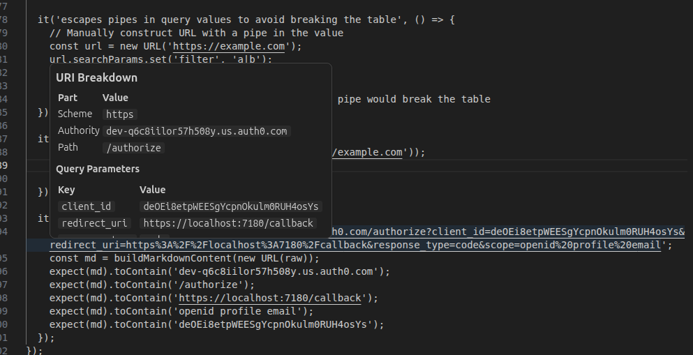

# URI Extract

A VS Code extension that breaks apart URIs into their components when you hover over them.

## Features

Hover over any HTTP or HTTPS URI in any file to see a tooltip showing:

- **Scheme** — `https`, `http`
- **Authority** — host and optional port
- **Path**
- **Query parameters** — each key/value pair, URL-decoded
- **Fragment** — if present



### Example

Hovering over:

```
https://example.auth0.com/authorize?client_id=abc123&redirect_uri=https%3A%2F%2Flocalhost%3A7180%2Fcallback&scope=openid%20profile%20email
```

Shows:

| Part | Value |
|:-----|:------|
| Scheme | `https` |
| Authority | `example.auth0.com` |
| Path | `/authorize` |

**Query Parameters**

| Key | Value |
|:----|:------|
| `client_id` | `abc123` |
| `redirect_uri` | `https://localhost:7180/callback` |
| `scope` | `openid profile email` |

Note that percent-encoded values like `https%3A%2F%2Flocalhost%3A7180%2Fcallback` and `openid%20profile%20email` are automatically decoded.

## Usage

Just hover over any URI in any file — no configuration required.

## Development

```sh
pnpm install
```

Then press **F5** in VS Code to launch the Extension Development Host.

```sh
pnpm test          # run tests once
pnpm test:watch    # run tests in watch mode
```

## Releasing

### 1. Bump the version

Update `version` in `package.json` (follows [semver](https://semver.org)):

```sh
# e.g. for a patch release
npm version patch --no-git-tag-version
```

Commit the change:

```sh
git add package.json
git commit -m "chore: bump version to x.y.z"
git push origin master
```

### 2. Tag the commit as a release

```sh
git tag release
git push origin release
```

This triggers the release workflow, which:

1. Runs all tests — the release is aborted if any fail
2. Packages the extension into a `.vsix` file
3. Creates a GitHub Release with the `.vsix` attached

### Re-releasing the same version

The `release` tag is reusable. To move it to a new commit:

```sh
git push origin :release   # delete the remote tag
git tag -f release         # move the local tag to HEAD
git push origin release    # push the updated tag
```

### Publishing to the VS Code Marketplace

Add a `VSCE_PAT` secret to the repository (Settings → Secrets → Actions) containing a Personal Access Token from the [Visual Studio Marketplace publisher portal](https://marketplace.visualstudio.com/manage). Also add a `publisher` field to `package.json` matching your publisher ID.

When `VSCE_PAT` is present the release workflow will publish automatically after creating the GitHub Release.
